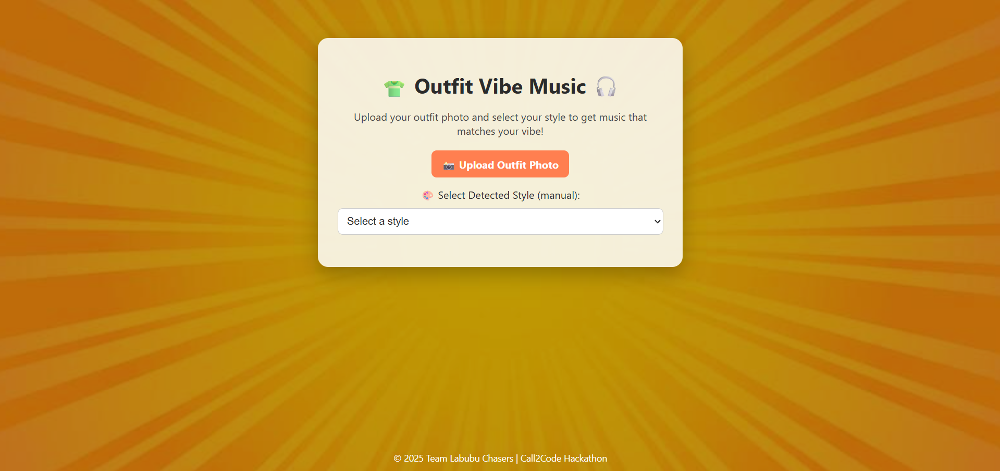
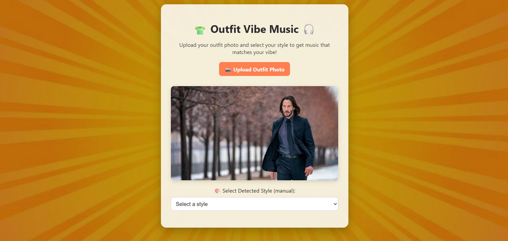
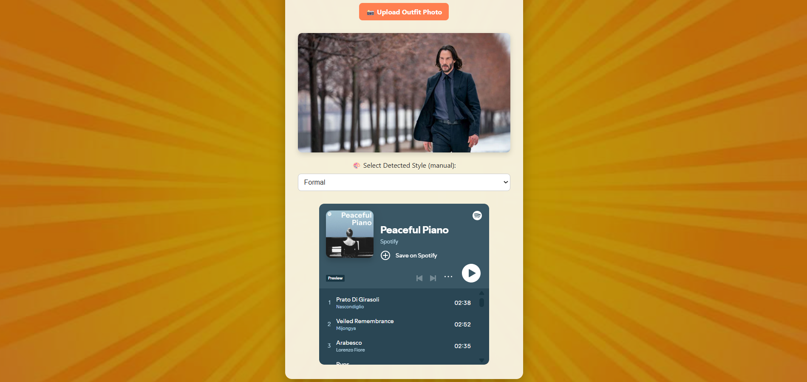

# 👕🎧 Outfit Vibe Music

*A fashion-meets-music web app that pairs your outfit's aesthetic with matching Spotify playlists.*  
Built for **Call2Code Hackathon 2025**.

> For Round 1, this is a manually-driven early prototype simulating what the final AI-driven experience would feel like.

---

## 🚀 Team
**Team Name:** Labubu Chasers  
**Hackathon:** Call2Code 2025  
**Members:** Ayush Kumar, Rajat Gupta, Shiv Sharma, Animesh Sharma

---


---

## 🌟 Features Implemented

### ✅ Easy Challenges
- **Dark Mode Support:** Toggle for user/system preference for better usability.
- **Creative 404/Error Handling:** Fun, emoji-rich error page with suggestions if the AI fails to detect an outfit.
- **Custom Loading States:** Animated, themed loading indicators during analysis.

### ✅ Medium Challenges
- **Dynamic Theming Based on API Data:** Sky background transitions based on time of day.
- **Multilingual Support:** One-click translation between English, Hindi, Tamil, Telugu, Bengali, and Marathi.

### ✅ Hard Challenges
- **Text-to-Speech for Content:** Web Speech API integration to read aloud any major text, with a global toggle for accessibility.

---

## ⚙️ APIs Used
- **Supabase**
  - Auth API for sign-up/login
  - Storage API for outfit image uploads
  - Database API for storing and fetching playlist mappings
- **AI Image Classification API** *(planned for production)* for automated vibe detection
- **Spotify Embed API** for streaming matching playlists
- **Web Speech API** for Text-to-Speech functionality

---

## 📸 Screenshots
| Screen | Description |
| ------ | ----------- |
|  | Homepage with dynamic sky, dark mode toggle |
|  | Outfit upload and preview screen |
|  | Curated Spotify playlist recommendations |
|  | Creative error page |
|  | Manual vibe selection |
|  | Text-to-Speech controls |
|  | Multilingual support demo |
|  | Custom loading state animation |
|  | Live IST time display |
|  | Sign-up/login with Supabase Auth |

*(Replace or add your actual screenshots in these slots.)*

---

## 🛠️ Tech Stack
- HTML, CSS, JavaScript
- Supabase (Auth, Storage, Database)
- Spotify Embed API
- Web Speech API

---

## 🌐 Link to Deployment
[**Live Demo Here**](https://your-deployment-link.com)

---

## 🧪 Setup and Testing Instructions

1️⃣ Clone the repository:
```bash
git clone https://github.com/yourusername/outfit-vibe-music.git
cd outfit-vibe-music
2️⃣ Install dependencies (if using any, e.g. npm for frameworks):
bash
Copy
Edit
npm install
(Skip if pure HTML/CSS/JS.)

3️⃣ Add your Supabase project URL and Anon Key in supa-config.js:
javascript
Copy
Edit
const SUPABASE_URL = 'your-supabase-url';
const SUPABASE_ANON_KEY = 'your-anon-key';

4️⃣ Start a local server (optional for testing):
bash
Copy
Edit
npx live-server
Or simply open index.html in your browser.

5️⃣ Test Features:
Upload outfit photos

Try Manual Override

Check dynamic sky changes (day/night)

Toggle Dark Mode

Switch languages

Use Text-to-Speech

Observe creative error page by submitting blank or invalid images


