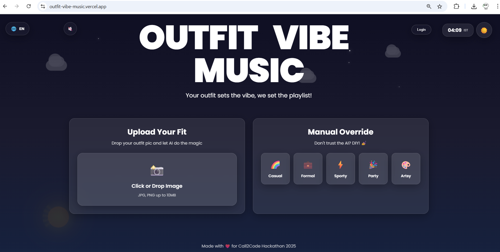
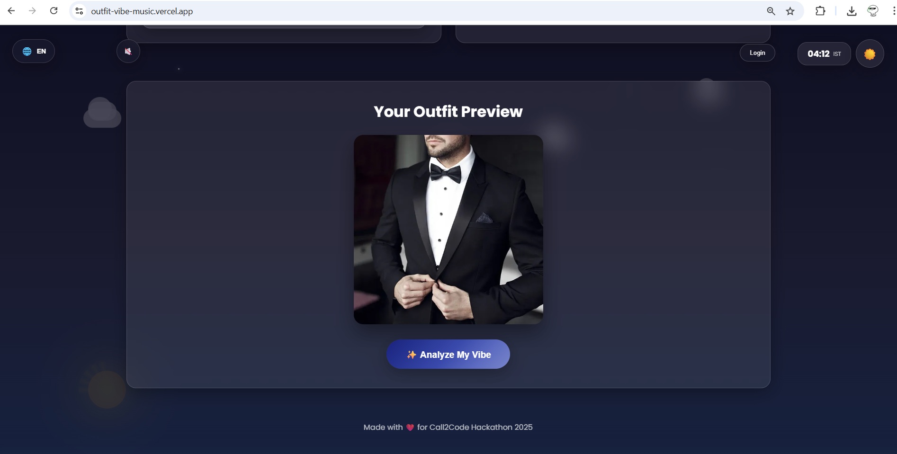
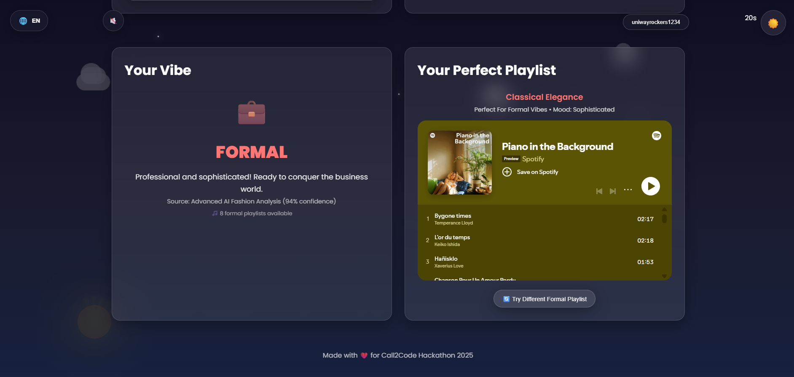
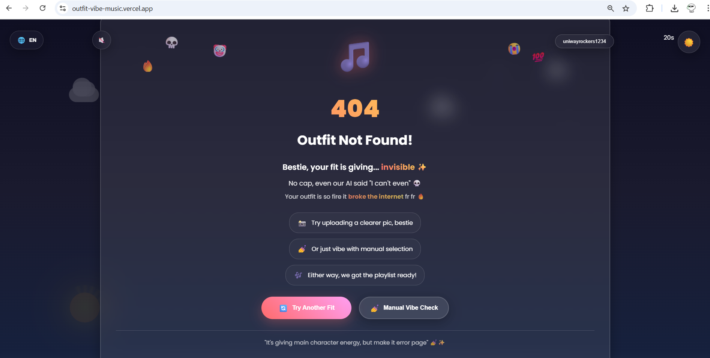
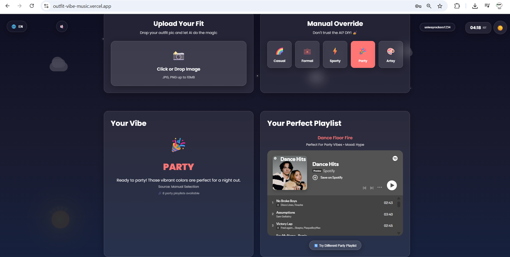
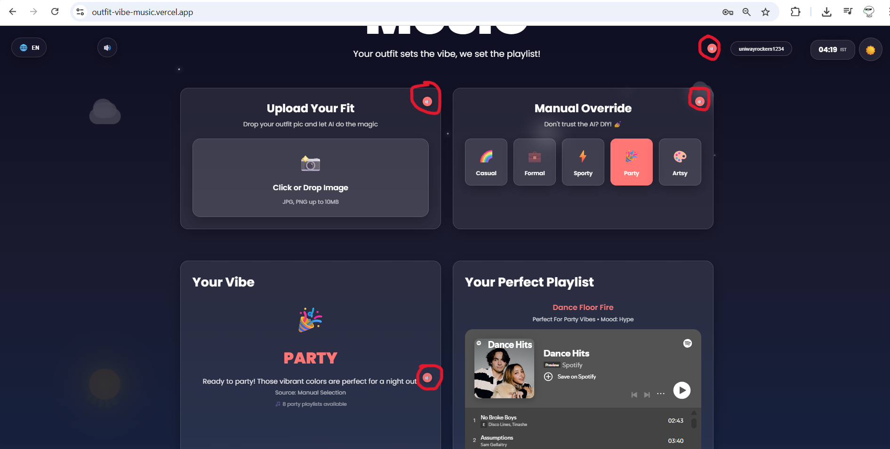
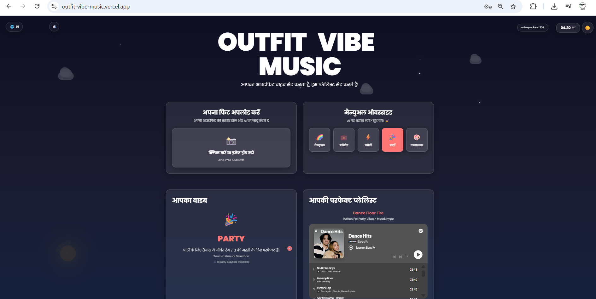
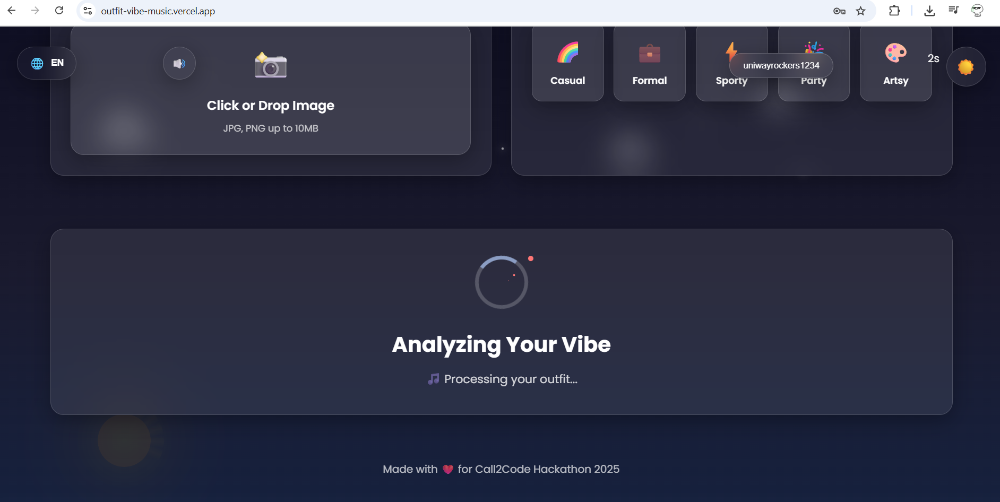
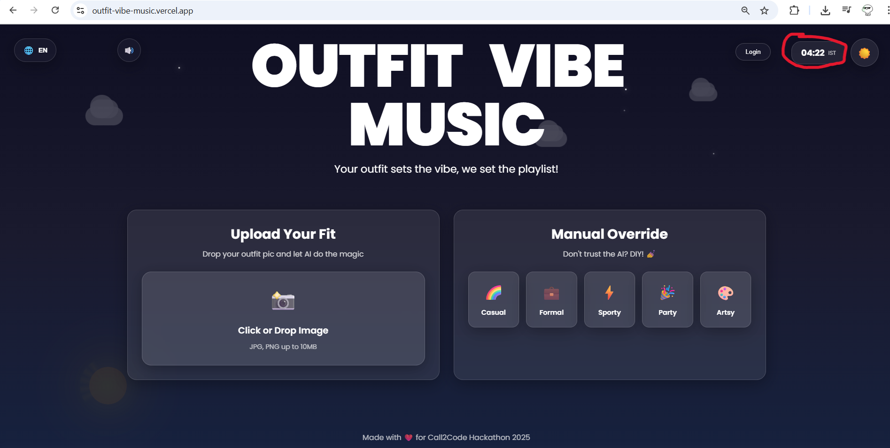
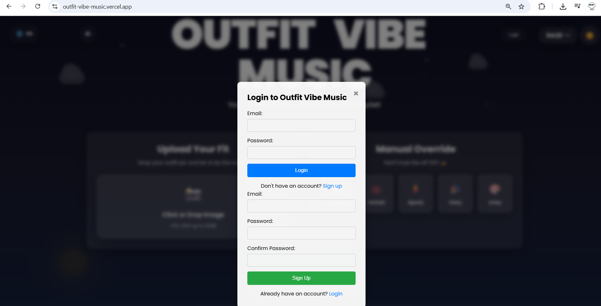

# 👕🎧 Outfit Vibe Music

*A fashion-meets-music web app that pairs your outfit's aesthetic with matching Spotify playlists.*  
Built for **Call2Code Hackathon 2025**.

---

##  Team
**Team Name:** Labubu Chasers  
**Hackathon:** Call2Code 2025  
**Members:** Ayush Kumar, Animesh Sharma, Rajat Gupta, Shiv Sharma

---

##  File Structure

outfit-vibe-music/
├── index.html
├── style.css
├── script.js
├── favicon.png
├── screenshot1.png
├── screenshot2.png
├── screenshot3.png
├── screenshot4.png
├── screenshot5.png
├── screenshot6.png
├── screenshot7.png
├── screenshot8.png
├── screenshot9.png
├── screenshot10.png
└── README.md

---

##  Features Implemented

### ✅ Easy Challenges
- **Dark Mode Support:** Toggle for user/system preference for better usability.
- **Creative 404/Error Handling:** Fun, emoji-rich error page with suggestions if the AI fails to detect an outfit.
- **Custom Loading States:** Animated, themed loading indicators during analysis.

### ✅ Medium Challenges
- **Dynamic Theming Based on API Data:** Sky background transitions based on time of day.
- **Multilingual Support:** One-click translation between English, Hindi, Tamil, Telugu, Bengali, and Marathi.

### ✅ Hard Challenges
- **Text-to-Speech for Content:** Web Speech API integration to read aloud any major text, with a global toggle for accessibility.

---

##  APIs Used

- **Supabase Auth API** – For secure user sign-up and login (email & Gmail)  
- **Supabase Storage API** – For uploading and storing outfit check images  
- **Supabase Database API** – For saving and fetching outfit data with playlists  
- **Spotify Embed API** – For streaming curated Spotify playlists based on outfit style  
- **Speech Synthesis API** – For converting playlist vibe into spoken words (Text-to-Speech)  
- **File API** – For handling image uploads directly from user device  
- **Canvas API** – For rendering and analyzing uploaded outfit images  
- **DOM API** – For dynamic interaction with the frontend interface  
- **Geolocation/Time API** – For detecting user location and time to personalize vibe  
- **AI Image Classification API** _(planned)_ – For automatic detection of outfit style from images

---

##  Screenshots
| Screen | Description |
| ------ | ----------- |
|  | Homepage with dynamic sky, dark mode toggle |
|  | Outfit upload and preview screen |
|  | Curated Spotify playlist recommendations |
|  | Creative error page |
|  | Manual vibe selection |
|  | Text-to-Speech controls |
|  | Multilingual support demo |
|  | Custom loading state animation |
|  | Live IST time display |
|  | Sign-up/login with Supabase Auth |

---

## Tech Stack

### 🔹 Frontend
- HTML5
- CSS3
- JavaScript (Vanilla)
- Canvas API for image rendering
- Speech Synthesis for Text-to-Speech
- Netlify for frontend deployment

### 🔹 Backend
- Supabase (Auth, Storage, Database)
- PostgreSQL (via Supabase)
- Row Level Security (RLS) for secure data access

### 🔹 Tools & Integration
- Git & GitHub for version control
- Google OAuth via Supabase for social login
- Spotify Embed for playlist streaming

---

## 🌐 Link to Deployment
[**Live Demo Here**](https://ovm.netlify.app/)

---

## 🧪 Setup and Testing Instructions

1️⃣ Clone the repository:

git clone https://github.com/rajatgupta57/outfit-vibe-music.git

cd outfit-vibe-music

2️⃣ Install dependencies (if using any, e.g. npm for frameworks):

npm install

3️⃣ Add your Supabase project URL and Anon Key in supa-config.js:

const SUPABASE_URL = 'your-supabase-url';

const SUPABASE_ANON_KEY = 'your-anon-key';

4️⃣ Start a local server (optional for testing):

npx live-server

Or simply open index.html in your browser.

5️⃣ Test Features:

Upload outfit photos

Try Manual Override

Check dynamic sky changes (day/night)

Toggle Dark Mode

Switch languages

Use Text-to-Speech

Observe creative error page by submitting blank or invalid images

